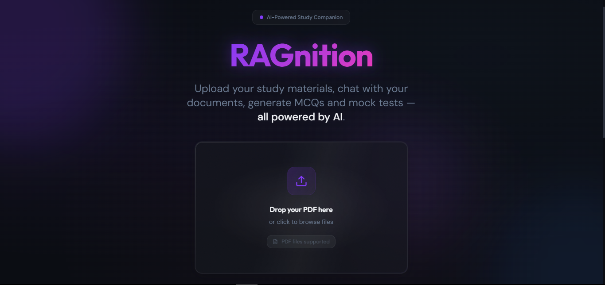
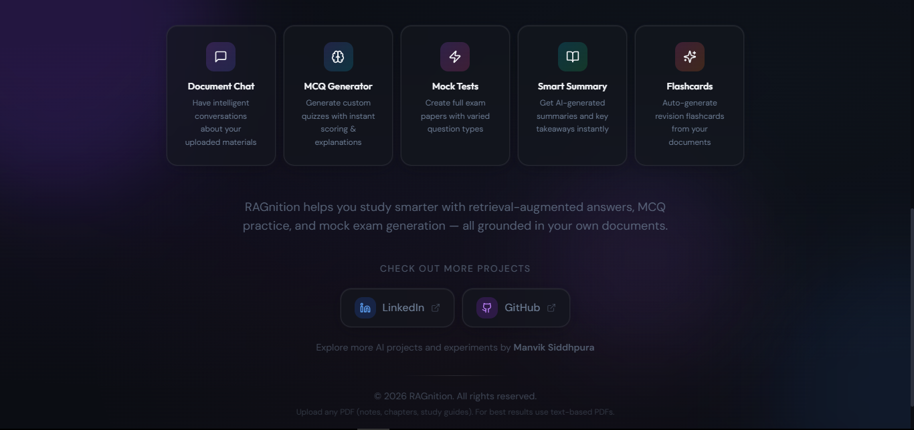
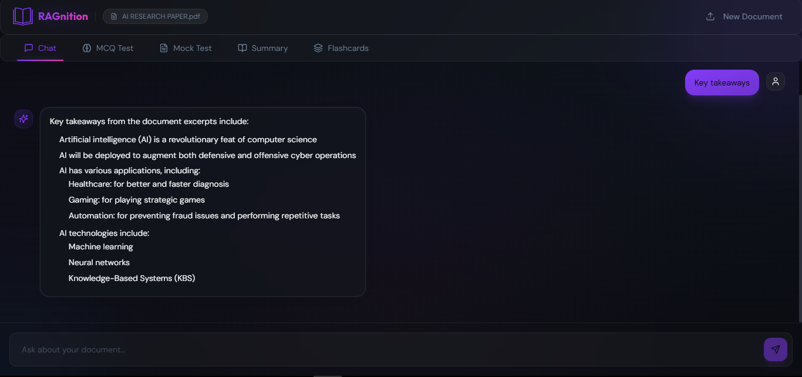
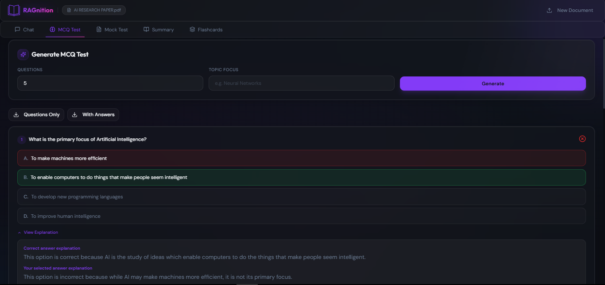
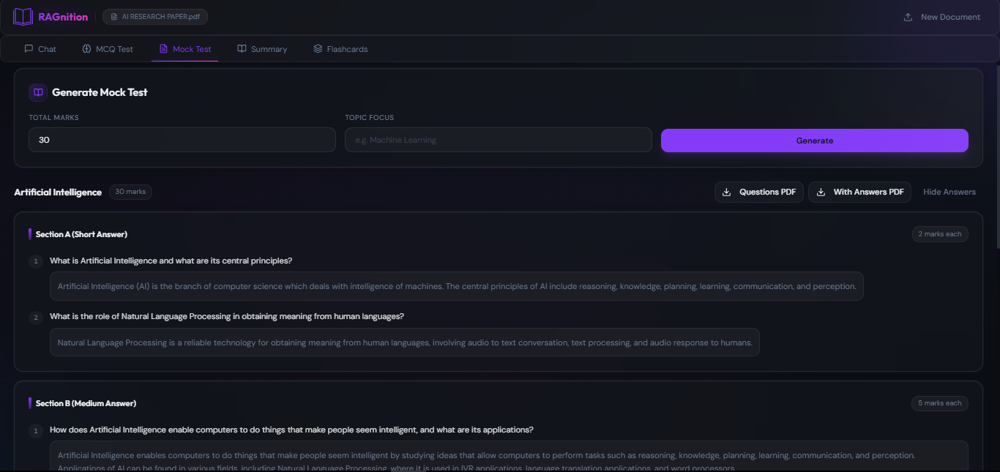
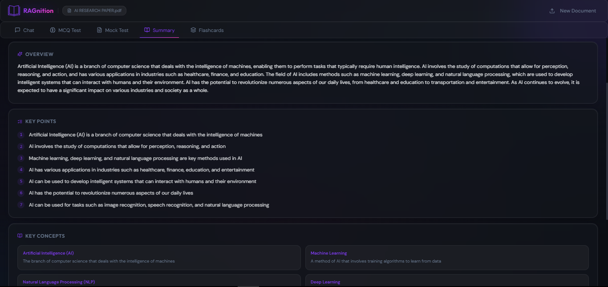
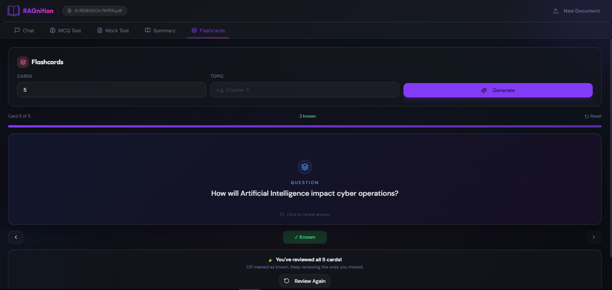

<div align="center">

<br/>

```
██████╗  █████╗  ██████╗ ███╗  ██╗██╗████████╗██╗ ██████╗ ███╗  ██╗
██╔══██╗██╔══██╗██╔════╝ ████╗ ██║██║╚══██╔══╝██║██╔═══██╗████╗ ██║
██████╔╝███████║██║  ███╗██╔██╗██║██║   ██║   ██║██║   ██║██╔██╗██║
██╔══██╗██╔══██║██║   ██║██║╚████║██║   ██║   ██║██║   ██║██║╚████║
██║  ██║██║  ██║╚██████╔╝██║ ╚███║██║   ██║   ██║╚██████╔╝██║ ╚███║
╚═╝  ╚═╝╚═╝  ╚═╝ ╚═════╝ ╚═╝  ╚══╝╚═╝   ╚═╝   ╚═╝ ╚═════╝ ╚═╝  ╚══╝
```

### Your Personal AI Study Companion

**Transform any PDF into an intelligent, interactive learning experience.**  
Chat with documents · Generate MCQs · Create Mock Exams · Auto-Flashcards · Smart Summaries

<br/>


<br/>

</div>

<div align="center">
  
</div>

---

## What is RAGnition?

RAGnition is a **full-stack AI study platform** that lets you upload any PDF and immediately start learning from it — intelligently. It uses **Retrieval-Augmented Generation (RAG)** to ground every AI response in your actual document, so you get accurate, context-aware answers rather than hallucinations.

Under the hood, your document is chunked, embedded with `BAAI/bge-base-en-v1.5`, and indexed in a FAISS vector store. At query time, hybrid BM25 + vector search retrieves the most relevant excerpts, which are passed to **Llama 3** via Groq's blazing-fast inference API.

> **No cloud uploads. No subscriptions. Your documents stay on your machine.**

---

### 📸 Screenshots

<table>
  <tr>
    <td></td>
    <td></td>
  </tr>
  <tr>
    <td></td>
    <td></td>
  </tr>
  <tr>
    <td></td>
    <td></td>
  </tr>
</table>

---

## Features

| Feature | Description |
|---|---|
| 💬 **Document Chat** | Ask questions in natural language and get AI answers grounded in your PDF |
| 📝 **MCQ Generator** | Generate up to 50 multiple-choice questions with scoring and per-option explanations |
| 🎓 **Mock Tests** | Full exam papers auto-divided into Section A / B / C by marks weighting |
| 🃏 **Auto Flashcards** | Flip-card revision with hint system, known/unknown tracking, and progress bar |
| 📑 **Smart Summary** | Key points, concept glossary, and study tips — downloadable as PDF |
| 📄 **PDF Export** | Download every output (chat history, MCQs, mock tests, summaries) as formatted PDF |
| 🎨 **Premium UI** | Glassmorphism design, cursor-reactive 3D tilt cards, Framer Motion animations |
| 📱 **Fully Responsive** | Works on desktop, tablet, and mobile with native bottom tab navigation |

---

## Tech Stack

### Frontend
```
React 18 + TypeScript    →  UI framework
Vite 5                   →  Build tool & dev server (with /api proxy)
Tailwind CSS 3           →  Utility-first styling
Framer Motion 12         →  Animations & 3D glass tilt effect
shadcn/ui + Radix UI     →  Accessible component primitives
React Router v6          →  Client-side routing
react-markdown           →  Markdown rendering in chat
```

### Backend
```
FastAPI                  →  Async REST API
pypdf                    →  PDF text extraction
sentence-transformers    →  BAAI/bge-base-en-v1.5 embeddings
faiss-cpu                →  Vector similarity search
rank-bm25                →  Keyword search (hybrid retrieval)
Groq API                 →  Llama 3 inference (fast & free tier available)
reportlab                →  Server-side PDF generation
python-dotenv            →  Environment config
```

---

## Quick Start

### Prerequisites
- **Node.js** v18 or higher
- **Python** 3.10 or higher
- **Groq API key** — free at [console.groq.com](https://console.groq.com)

---

### Step 1 — Clone & Configure

```bash
git clone https://github.com/your-username/RAGnition.git
cd RAGnition
```

Create a `.env` file in the project root:

```env
# Required — get yours free at https://console.groq.com
GROQ_API_KEY=your_groq_api_key_here

# Model (llama-3.3-70b-versatile recommended)
GROQ_MODEL=llama-3.3-70b-versatile

# Leave empty — Vite proxy handles routing to backend
VITE_API_BASE_URL=
```

---

### Step 2 — Start the Backend

```bash
cd backend

# Create a virtual environment (recommended)
python -m venv .venv

# Activate it
# Windows:
.venv\Scripts\activate
# macOS / Linux:
source .venv/bin/activate

# Install dependencies
pip install -r requirements.txt

# Start the server
uvicorn main:app --reload --host 0.0.0.0 --port 8000
```

> **First run:** The embedding model (`BAAI/bge-base-en-v1.5`, ~440 MB) will download automatically.  
> Wait for the terminal to print: `Embedder ready.`

---

### Step 3 — Start the Frontend

Open a **new terminal** in the project root:

```bash
npm install
npm run dev
```

Open [http://localhost:8080](http://localhost:8080) — you're ready.

---

## How It Works

```
┌─────────────────────────────────────────────────────────────┐
│                        USER UPLOADS PDF                      │
└──────────────────────────┬──────────────────────────────────┘
                           │
                    ┌──────▼──────┐
                    │  pypdf      │  Extract raw text
                    └──────┬──────┘
                           │
                    ┌──────▼──────┐
                    │  Chunker    │  800-char chunks, 200-char overlap
                    └──────┬──────┘
                           │
               ┌───────────▼───────────┐
               │  BAAI/bge-base-en-v1.5│  Generate embeddings
               └───────────┬───────────┘
                           │
          ┌────────────────▼────────────────┐
          │  FAISS IndexFlatIP  +  BM25Okapi │  Dual index
          └────────────────┬────────────────┘
                           │
                    ┌──────▼──────┐
                    │  docId      │  Returned to frontend
                    └─────────────┘

         AT QUERY TIME:
         Query → BM25 scores + Vector scores
                    │
              Fusion (α=0.6)
                    │
            Top-K excerpts retrieved
                    │
            Groq Llama 3 + system prompt
                    │
             Grounded AI response
```

---

## Project Structure

```
RAGnition/
│
├── backend/
│   ├── main.py               # FastAPI app — all RAG logic, endpoints, PDF rendering
│   └── requirements.txt      # Python dependencies
│
├── src/
│   ├── components/
│   │   ├── CursorTiltGlassCard.tsx   # 3D glass card with cursor-reactive glare
│   │   ├── DocumentUpload.tsx        # Landing / upload page
│   │   ├── ChatInterface.tsx         # Document Q&A chat
│   │   ├── MCQGenerator.tsx          # MCQ quiz with scoring
│   │   ├── MockTestGenerator.tsx     # Full exam paper generator
│   │   ├── SummaryPanel.tsx          # Smart summary with PDF export
│   │   ├── FlashcardPanel.tsx        # Flip-card revision mode
│   │   └── GlassCursor.tsx           # Custom glass cursor (desktop)
│   │
│   ├── context/
│   │   └── DocumentContext.tsx       # Global PDF state (docId, fileName)
│   │
│   ├── lib/
│   │   └── ragApi.ts                 # Typed fetch client (uses Vite proxy)
│   │
│   ├── pages/
│   │   └── Dashboard.tsx             # Responsive tabbed dashboard
│   │
│   └── index.css                     # Tailwind + glassmorphism tokens
│
├── vite.config.ts                    # Dev proxy: /api → localhost:8000
├── .env                              # API keys & config
├── package.json
└── README.md
```

---

## License

All rights reserved © [Manvik Siddhpura](https://github.com/Manwikkk)

---

<div align="center">

Built with ❤️ by **Manvik Siddhpura**

*If this project helped you study smarter, give it a ⭐*

</div>
